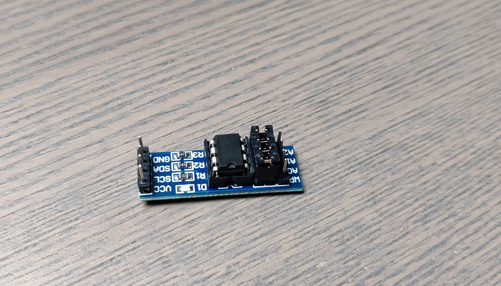
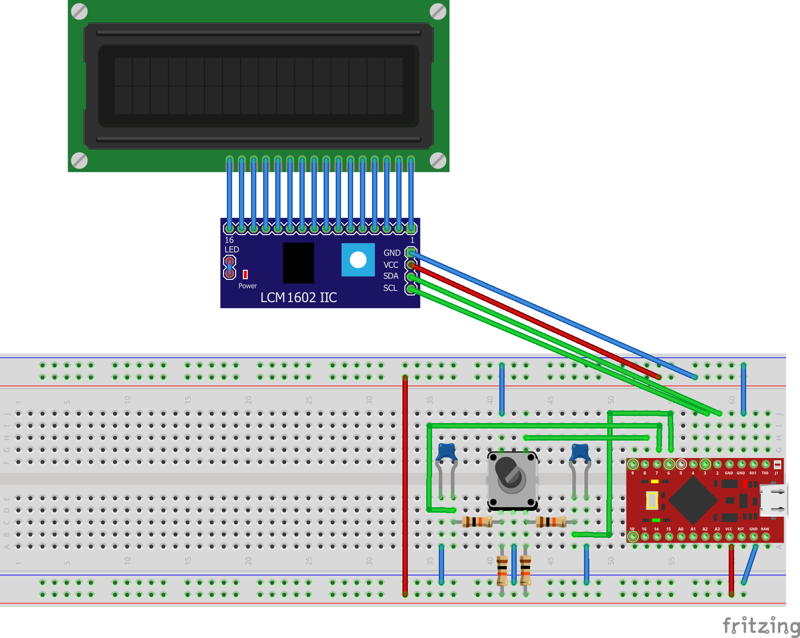

# deej volume controller

This is a modified version of deej ([Original deej](https://github.com/omriharel/deej)). I always wanted some simple way of changing volume of different programs instead of using the mixer of Windows so I came across the deej project and decided to give it a try.

[Extra photos/video](https://imgur.com/a/3zxhjxF)

# Build process

My first idea was to use a LCD (I2C), a rotary encoder and an Arduino pro micro to display the slider values on the screen in %. I wrote a simple Arduino code that maps the value from 0-100 to 0-1023, this code was working a bit but it wasn't accurate. When decreasing by 5% on the lcd, it decreased sometimes by 4 or 6 in Windows. With some help from other people in the deej Discord we tried to map correctly (the map function doesn't round the value). When achieving this the code still didn't work. So I moved on to modifying deej. After hours of trying to understand how deej works, I found some interessting lines in the serial.go and util.go files. I removed the noise reduction, changed the mapping to 0-100 and removed the "normalize" feature. After modifying the build I got my setup working.

# Parts needed

- 1 rotary encoder with pushbutton, preferably a module so you don't need a extra filter circuit
- 1 Arduino pro micro (any other clone or Arduino board with an usb connection will do the job)
- 1 LCD (I used an I²C 16*2. When using a normal screen you need to change the library in the arduino code. If you modify the Arduino code you could use a bigger LCD)
- (if needed) filter circuit for rotary encoder
  - 4 10kohm resistors
  - 2 10nF (=0.01µF) ceramic capacitors
- (Extra) I²C EEPROM Module


I created a extra filterboard, but without it works just fine.

This is an example of an external EEPROM module.

# Schematic


This is the schematic for the deej build without external EEPROM.

This is the schematic for the deej build with external EEPROM. I used an IC in the schematic but using a module would also work fine (without the resistors).

# Arduino code

The arduino code is based on the stock code from deej but is quite modified. There are 2 version available, one with EEPROM and the other one without EEPROM. (read the README.txt in the Arduino folder for a more detailed explanation). EEPROM is some sort of storage that doesn't lose it's data when the power drops down. The values of the sliders get stored into the EEPROM regularly. So when rebooting the deej box, the values from last time will be used. It is important to know that the EEPROM has about 100 000 write cycle and from than it becomes unstable. So use the EEPROM at your own risk. If you want to use EEPROM on your build I suggest going for an external EEPROM module since you can change the IC for cheap.

The libraries used are libraries either stock in arduino, or can be installed through the build-in library manager of arduino (Sketch > Include Library > Manage Libraries).

# Rotary encoder

I suggest using a rotarty encoder with a filter (resister and capacitor), but it is possible to use it without the filter, but then you need to connect the 2 outer pins directly to the microcontroller and change some code. The code that needs to be changed is simple: change

```
void setup()
{
  pinMode(SW, INPUT_PULLUP);
  pinMode(PIN_ENCODER_A, INPUT);
  pinMode(PIN_ENCODER_B, INPUT);
  \\ rest of code comes here
}
```

to

```
void setup()
{
  pinMode(SW, INPUT_PULLUP);
  pinMode(PIN_ENCODER_A, INPUT_PULLUP);
  pinMode(PIN_ENCODER_B, INPUT_PULLUP);
  \\ rest of code comes here
}
```

# 3D printing

The case is a remixed version of daggr's design (which is a remix of nightfox939's design) and can be found on [Printables](https://www.printables.com/model/271221-deej-lcd-and-encoder-box) or in the stl folder. It doesn't have the nano mount, so the microcontroller must be glued in the case. It does have a usb-c opening for one of these [boards](https://www.amazon.de/-/en/gp/product/B09FPZDDD9). I printed it with 15% infill, 0.2 layer height and support at an 47° angle so there is only support at the usb socket.
The knob is a model of Neolker and can be found [here](https://www.printables.com/model/242353-diamond-knob) or in the stl folder.

# Building deej

This is a custom version of the deej and needs to be builded, this can be done in the scripts folder.

# Contact

If you got any questions you can start a pull request, issue or contact me on the [deej Discord server](https://discord.gg/nf88NJu).
